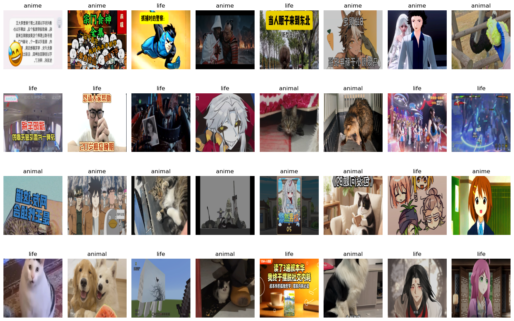
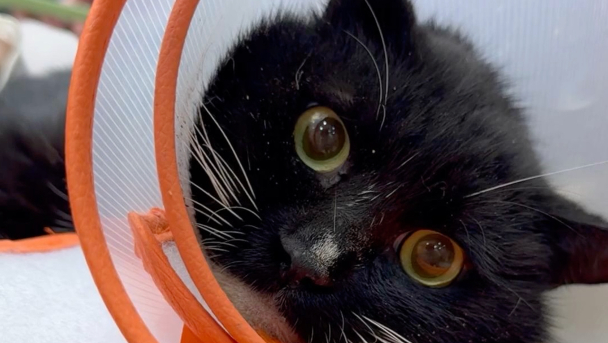
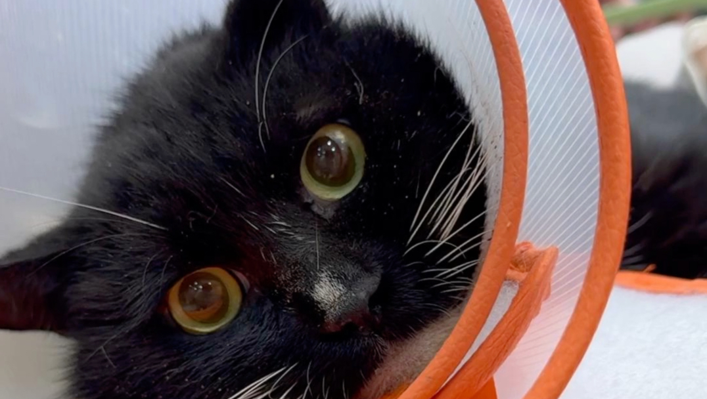
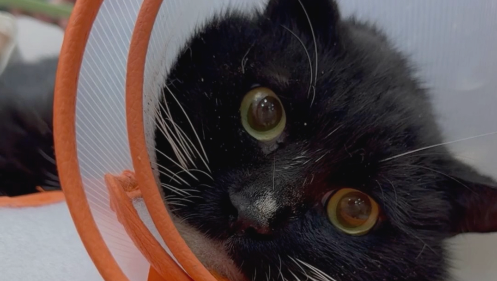

# 作业2

## 1. 你构建了什么数据集？数据来源是哪里？包含多少个类别和样本？

构建了b站动物区，动画区，生活区的封面的数据库，数据来源于b站 api ，包含三个类别，每个类别 50 个样本

## 2. 展示你的 CustomDataset 类的代码，并解释你是如何处理图片读取和异常值的

```python

class MyDataset(Dataset):
    def __init__(self,image_paths,labels,transform=None):
        self.image_paths=image_paths
        self.labels=labels
        self.transfrom=transform

    def __len__(self):
        return len(self.image_paths)
    
    def __getitem__(self, index):
        img_path=self.image_paths[index]
        try:
            img=Image.open(img_path).convert('RGB')
            label=self.labels[index]
            if self.transfrom:
                img=self.transfrom(img)
            return img,label
        except Exception as e:
            print("发生错误：",e)
            new_idx=random.randint(0,len(self)-1)
            return self.__getitem__(new_idx)
```

从 img_paths 中读取文件储存地址 img_path , 使用 img=Image.open(img_path).convert('RGB') 读取图片，在发生错误时，再随机读取另一个图片

## 3. 展示你的 transforms 配置。
```python
my_transforms=transforms.Compose([
    transforms.Resize((224,224)),
    transforms.RandomHorizontalFlip(),
    transforms.ColorJitter(brightness=0.2,contrast=0.2),
    transforms.ToTensor()
])
```

### i. 贴出 DataLoader 读取出的 Batch 可视化截图



### ii. 对比原始图片与增强后的图片，分析增强策略是否合理

**原始图片**



**水平翻转**



**亮度与对比度变化**



增强策略在保留了图片特征的同时丰富了样本，增加了噪声，合理

## 4. 在处理脏数据的过程中，你踩了哪些坑？

原始图片尺寸不一，需要通过 transforms.Resize 来统一